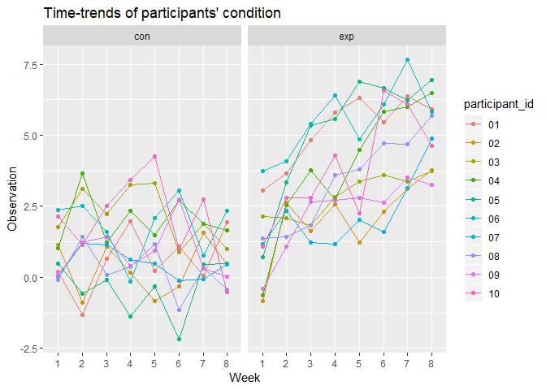
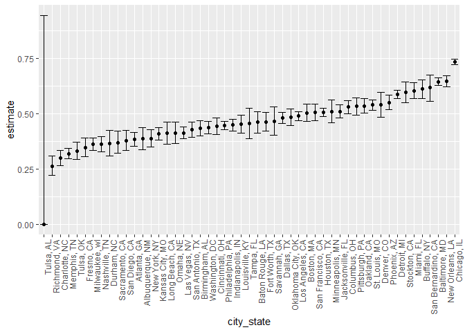

Homework 5 - Data Science I
================
Sunny Siddique
November 7, 2018

**Problem 1: Analysis of a longitudinal study data that contains a treatment arm and a placebo arm.**

``` r
#Setting global parameters and loading relevant packages
knitr::opts_chunk$set(echo = TRUE)
library(tidyverse)
library(purrr)
```

In attempting to import the dataset, I am first using the list.files function to view the files for the study participants. There are 20 different files (10 containing data for individuals in the treatment arm and 10 containing data for individuals in the control arm).

``` r
#Creating a new object "files" to which to store the datafiles.
files = list.files("./data")
files
```

    ##  [1] "con_01.csv" "con_02.csv" "con_03.csv" "con_04.csv" "con_05.csv"
    ##  [6] "con_06.csv" "con_07.csv" "con_08.csv" "con_09.csv" "con_10.csv"
    ## [11] "exp_01.csv" "exp_02.csv" "exp_03.csv" "exp_04.csv" "exp_05.csv"
    ## [16] "exp_06.csv" "exp_07.csv" "exp_08.csv" "exp_09.csv" "exp_10.csv"

``` r
#Saving the datafiles into raw list and then assigning it to "datasets".
raw = str_c("./data/", files)
datasets = tibble(subjects = files) %>% 
  mutate(data = map(raw, read_csv))
datasets
```

    ## # A tibble: 20 x 2
    ##    subjects   data            
    ##    <chr>      <list>          
    ##  1 con_01.csv <tibble [1 x 8]>
    ##  2 con_02.csv <tibble [1 x 8]>
    ##  3 con_03.csv <tibble [1 x 8]>
    ##  4 con_04.csv <tibble [1 x 8]>
    ##  5 con_05.csv <tibble [1 x 8]>
    ##  6 con_06.csv <tibble [1 x 8]>
    ##  7 con_07.csv <tibble [1 x 8]>
    ##  8 con_08.csv <tibble [1 x 8]>
    ##  9 con_09.csv <tibble [1 x 8]>
    ## 10 con_10.csv <tibble [1 x 8]>
    ## 11 exp_01.csv <tibble [1 x 8]>
    ## 12 exp_02.csv <tibble [1 x 8]>
    ## 13 exp_03.csv <tibble [1 x 8]>
    ## 14 exp_04.csv <tibble [1 x 8]>
    ## 15 exp_05.csv <tibble [1 x 8]>
    ## 16 exp_06.csv <tibble [1 x 8]>
    ## 17 exp_07.csv <tibble [1 x 8]>
    ## 18 exp_08.csv <tibble [1 x 8]>
    ## 19 exp_09.csv <tibble [1 x 8]>
    ## 20 exp_10.csv <tibble [1 x 8]>

In order to tidy up the dataset, I took the following steps:

``` r
#Assigning the tidy dataset into "participants" 
participants = unnest(datasets) %>% 

#Separating the subject variable into treatment "arm" and participant "id" variable.
  separate (subjects, into = c("arm", "id"), sep = "_") %>% 
  
#Separating the id varaible into "participant_id" and a variable called "remove" that will be dropped later. 
  separate (id, into = c("participant_id", "remove"), sep = 2) %>% 
  
#Dropping the "remove" variable
  select (-remove) %>% 
  
#Gathering the week variables under one column. 
  gather (key = week, value = observation, week_1:week_8) %>% 
  
#Tidying the week variable. 
  separate (week, into = c("remove", "week"), sep = "_") %>% 
  
#Removing the extra column
  select (-remove)

#Viewing the resulting dataset. 
head(participants)
```

    ## # A tibble: 6 x 4
    ##   arm   participant_id week  observation
    ##   <chr> <chr>          <chr>       <dbl>
    ## 1 con   01             1            0.2 
    ## 2 con   02             1            1.13
    ## 3 con   03             1            1.77
    ## 4 con   04             1            1.04
    ## 5 con   05             1            0.47
    ## 6 con   06             1            2.37

Making a spaghetti plot showing observations on each subject over time.

``` r
#Naming the spaghetti plot, "spaghetti"
spaghetti = participants %>% 
  
#Converting the participant_id into a character variable and the treatment arm varible into a factor variable to be able to piece together the spaghetti plot. 
  mutate(participant_id = as.character(participant_id),
         arm = as.factor(arm)) %>% 
  
#Generating spaghettiplot using ggplot. 
  ggplot(aes(x = week, y = observation, color = participant_id, group = participant_id)) +
  geom_point() + 
  geom_line() +
  facet_grid(~arm) +
  labs (
    title = "Time-trends of participants' condition",
        x = "Week",
        y = "Observation"
  )

#Viewing the spaghetti plot. 
spaghetti
```



In the spaghetti plot above, it appears that with time, the observation values for those in the experimental group appeared to increase whereas for those in the control group, the observation values remained approximately the same. Even though in the experimental group, there are small fluctuations each week, their overall trend seems to be increase with time.

------------------------------------------------------------------------

**Problem 2: Analysis of homicide data in 50 large US cities, by the Washington Post.**

``` r
#Reading in the dataset
homicide_data = read_csv("./homicide-data.csv") %>% 
  janitor::clean_names()
```

    ## Parsed with column specification:
    ## cols(
    ##   uid = col_character(),
    ##   reported_date = col_integer(),
    ##   victim_last = col_character(),
    ##   victim_first = col_character(),
    ##   victim_race = col_character(),
    ##   victim_age = col_character(),
    ##   victim_sex = col_character(),
    ##   city = col_character(),
    ##   state = col_character(),
    ##   lat = col_double(),
    ##   lon = col_double(),
    ##   disposition = col_character()
    ## )

This the dimension of this dataset is 52179, 12.

Create a city\_state variable (e.g. “Baltimore, MD”) and then summarize within cities to obtain the total number of homicides and the number of unsolved homicides (those for which the disposition is “Closed without arrest” or “Open/No arrest”).

``` r
homicide_totals = homicide_data %>% 
  mutate(city_state = str_c(city, state, sep = ", ")) %>% 
  group_by(city_state) %>% 
  nest() %>% 
  mutate (total_homicides = map(.x = data, ~.x %>% count()),
          total_unsolved = map(.x = data, ~.x %>% 
                                 filter(disposition %in% c("Closed without arrest","Open/No arrest")) %>% 
                                 count())) %>% 
  select(city_state, total_homicides, total_unsolved) %>% 
  unnest() %>% 
  mutate(total_homicides = n, total_unsolved = n1)
homicide_total = homicide_totals %>% 
  select(-n, -n1)
homicide_total
```

    ## # A tibble: 51 x 3
    ##    city_state      total_homicides total_unsolved
    ##    <chr>                     <int>          <int>
    ##  1 Albuquerque, NM             378            146
    ##  2 Atlanta, GA                 973            373
    ##  3 Baltimore, MD              2827           1825
    ##  4 Baton Rouge, LA             424            196
    ##  5 Birmingham, AL              800            347
    ##  6 Boston, MA                  614            310
    ##  7 Buffalo, NY                 521            319
    ##  8 Charlotte, NC               687            206
    ##  9 Chicago, IL                5535           4073
    ## 10 Cincinnati, OH              694            309
    ## # ... with 41 more rows

For the city of Baltimore, MD, use the prop.test function to estimate the proportion of homicides that are unsolved; save the output of prop.test as an R object, apply the broom::tidy to this object and pull the estimated proportion and confidence intervals from the resulting tidy dataframe.

``` r
baltimore_data = homicide_total %>% 
  filter (city_state == "Baltimore, MD")

#filtering out data for baltimore. 

baltimore_proptest = 
  prop.test(baltimore_data$total_unsolved, baltimore_data$total_homicides) %>% 
  broom::tidy()
baltimore_proptest
```

    ## # A tibble: 1 x 8
    ##   estimate statistic  p.value parameter conf.low conf.high method
    ##      <dbl>     <dbl>    <dbl>     <int>    <dbl>     <dbl> <chr> 
    ## 1    0.646      239. 6.46e-54         1    0.628     0.663 1-sam~
    ## # ... with 1 more variable: alternative <chr>

``` r
balt_proptest = broom::tidy(prop.test(baltimore_data$total_unsolved, baltimore_data$total_homicides)) %>% 
  select(estimate, conf.low, conf.high)
```

Now run prop.test for each of the cities in your dataset, and extract both the proportion of unsolved homicides and the confidence interval for each. Do this within a “tidy” pipeline, making use of purrr::map, purrr::map2, list columns and unnest as necessary to create a tidy dataframe with estimated proportions and CIs for each city.

``` r
homicide_function = map2(.x = homicide_total$total_unsolved, .y = homicide_total$total_homicides, ~ prop.test(.x, .y))
```

    ## Warning in prop.test(.x, .y): Chi-squared approximation may be incorrect

``` r
all_proptest = map_df(.x = homicide_function, ~.x %>% 
                        broom::tidy(.x) %>% 
                        select(estimate, conf.low, conf.high)) %>% 
  mutate(city_state = homicide_total$city_state) %>% 
  select(city_state, everything())

homicide_data %>% 
  select(city, state) %>% 
  group_by(city, state)
```

    ## # A tibble: 52,179 x 2
    ## # Groups:   city, state [51]
    ##    city        state
    ##    <chr>       <chr>
    ##  1 Albuquerque NM   
    ##  2 Albuquerque NM   
    ##  3 Albuquerque NM   
    ##  4 Albuquerque NM   
    ##  5 Albuquerque NM   
    ##  6 Albuquerque NM   
    ##  7 Albuquerque NM   
    ##  8 Albuquerque NM   
    ##  9 Albuquerque NM   
    ## 10 Albuquerque NM   
    ## # ... with 52,169 more rows

Plotting the variables

``` r
all_proptest %>% 
  mutate(city_state = forcats::fct_reorder(city_state, estimate)) %>% 
  ggplot(aes(x = city_state, y = estimate)) + geom_point() +
  geom_errorbar(mapping = aes(ymin = conf.low, ymax = conf.high)) +
  theme(axis.text.x = element_text(angle = 90, hjust = 1))
```


