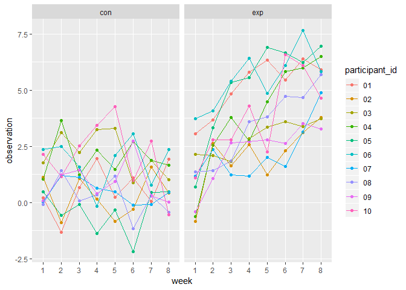

p8105\_hw5\_as5457
================
Sunny Siddique
November 7, 2018

``` r
library(tidyverse)
```

    ## -- Attaching packages ------------------------------------------------------------------ tidyverse 1.2.1 --

    ## v ggplot2 3.0.0     v purrr   0.2.5
    ## v tibble  1.4.2     v dplyr   0.7.6
    ## v tidyr   0.8.1     v stringr 1.3.1
    ## v readr   1.1.1     v forcats 0.3.0

    ## -- Conflicts --------------------------------------------------------------------- tidyverse_conflicts() --
    ## x dplyr::filter() masks stats::filter()
    ## x dplyr::lag()    masks stats::lag()

This zip file contains data from a longitudinal study that included a control arm and an experimental arm. Data for each participant is included in a separate file, and file names include the subject ID and arm.

Create a tidy dataframe containing data from all participants, including the subject ID, arm, and observations over time:

Start with a dataframe containing all file names; the list.files function will help Iterate over file names and read in data for each subject using purrr::map and saving the result as a new variable in the dataframe Tidy the result; manipulate file names to include control arm and subject ID, make sure weekly observations are “tidy”, and do any other tidying that’s necessary Make a spaghetti plot showing observations on each subject over time, and comment on differences between groups.

``` r
knitr::opts_chunk$set(echo = TRUE)
library(tidyverse)
library(purrr)
```

Trying to import the dataset.

``` r
list.files("./data")
```

    ##  [1] "con_01.csv"        "con_02.csv"        "con_03.csv"       
    ##  [4] "con_04.csv"        "con_05.csv"        "con_06.csv"       
    ##  [7] "con_07.csv"        "con_08.csv"        "con_09.csv"       
    ## [10] "con_10.csv"        "exp_01.csv"        "exp_02.csv"       
    ## [13] "exp_03.csv"        "exp_04.csv"        "exp_05.csv"       
    ## [16] "exp_06.csv"        "exp_07.csv"        "exp_08.csv"       
    ## [19] "exp_09.csv"        "exp_10.csv"        "homicide-data.csv"

There are 20 datafiles.

``` r
files <- list.files("./data")
files
```

    ##  [1] "con_01.csv"        "con_02.csv"        "con_03.csv"       
    ##  [4] "con_04.csv"        "con_05.csv"        "con_06.csv"       
    ##  [7] "con_07.csv"        "con_08.csv"        "con_09.csv"       
    ## [10] "con_10.csv"        "exp_01.csv"        "exp_02.csv"       
    ## [13] "exp_03.csv"        "exp_04.csv"        "exp_05.csv"       
    ## [16] "exp_06.csv"        "exp_07.csv"        "exp_08.csv"       
    ## [19] "exp_09.csv"        "exp_10.csv"        "homicide-data.csv"

``` r
raw = str_c("./data/", files)
datasets = tibble(subjects = files) %>% 
  mutate(data = map(raw, read_csv))
```

    ## Parsed with column specification:
    ## cols(
    ##   week_1 = col_double(),
    ##   week_2 = col_double(),
    ##   week_3 = col_double(),
    ##   week_4 = col_double(),
    ##   week_5 = col_double(),
    ##   week_6 = col_double(),
    ##   week_7 = col_double(),
    ##   week_8 = col_double()
    ## )
    ## Parsed with column specification:
    ## cols(
    ##   week_1 = col_double(),
    ##   week_2 = col_double(),
    ##   week_3 = col_double(),
    ##   week_4 = col_double(),
    ##   week_5 = col_double(),
    ##   week_6 = col_double(),
    ##   week_7 = col_double(),
    ##   week_8 = col_double()
    ## )
    ## Parsed with column specification:
    ## cols(
    ##   week_1 = col_double(),
    ##   week_2 = col_double(),
    ##   week_3 = col_double(),
    ##   week_4 = col_double(),
    ##   week_5 = col_double(),
    ##   week_6 = col_double(),
    ##   week_7 = col_double(),
    ##   week_8 = col_double()
    ## )
    ## Parsed with column specification:
    ## cols(
    ##   week_1 = col_double(),
    ##   week_2 = col_double(),
    ##   week_3 = col_double(),
    ##   week_4 = col_double(),
    ##   week_5 = col_double(),
    ##   week_6 = col_double(),
    ##   week_7 = col_double(),
    ##   week_8 = col_double()
    ## )
    ## Parsed with column specification:
    ## cols(
    ##   week_1 = col_double(),
    ##   week_2 = col_double(),
    ##   week_3 = col_double(),
    ##   week_4 = col_double(),
    ##   week_5 = col_double(),
    ##   week_6 = col_double(),
    ##   week_7 = col_double(),
    ##   week_8 = col_double()
    ## )
    ## Parsed with column specification:
    ## cols(
    ##   week_1 = col_double(),
    ##   week_2 = col_double(),
    ##   week_3 = col_double(),
    ##   week_4 = col_double(),
    ##   week_5 = col_double(),
    ##   week_6 = col_double(),
    ##   week_7 = col_double(),
    ##   week_8 = col_double()
    ## )
    ## Parsed with column specification:
    ## cols(
    ##   week_1 = col_double(),
    ##   week_2 = col_double(),
    ##   week_3 = col_double(),
    ##   week_4 = col_double(),
    ##   week_5 = col_double(),
    ##   week_6 = col_double(),
    ##   week_7 = col_double(),
    ##   week_8 = col_double()
    ## )
    ## Parsed with column specification:
    ## cols(
    ##   week_1 = col_double(),
    ##   week_2 = col_double(),
    ##   week_3 = col_double(),
    ##   week_4 = col_double(),
    ##   week_5 = col_double(),
    ##   week_6 = col_double(),
    ##   week_7 = col_double(),
    ##   week_8 = col_double()
    ## )
    ## Parsed with column specification:
    ## cols(
    ##   week_1 = col_double(),
    ##   week_2 = col_double(),
    ##   week_3 = col_double(),
    ##   week_4 = col_double(),
    ##   week_5 = col_double(),
    ##   week_6 = col_double(),
    ##   week_7 = col_double(),
    ##   week_8 = col_double()
    ## )
    ## Parsed with column specification:
    ## cols(
    ##   week_1 = col_double(),
    ##   week_2 = col_double(),
    ##   week_3 = col_double(),
    ##   week_4 = col_double(),
    ##   week_5 = col_double(),
    ##   week_6 = col_double(),
    ##   week_7 = col_double(),
    ##   week_8 = col_double()
    ## )
    ## Parsed with column specification:
    ## cols(
    ##   week_1 = col_double(),
    ##   week_2 = col_double(),
    ##   week_3 = col_double(),
    ##   week_4 = col_double(),
    ##   week_5 = col_double(),
    ##   week_6 = col_double(),
    ##   week_7 = col_double(),
    ##   week_8 = col_double()
    ## )
    ## Parsed with column specification:
    ## cols(
    ##   week_1 = col_double(),
    ##   week_2 = col_double(),
    ##   week_3 = col_double(),
    ##   week_4 = col_double(),
    ##   week_5 = col_double(),
    ##   week_6 = col_double(),
    ##   week_7 = col_double(),
    ##   week_8 = col_double()
    ## )
    ## Parsed with column specification:
    ## cols(
    ##   week_1 = col_double(),
    ##   week_2 = col_double(),
    ##   week_3 = col_double(),
    ##   week_4 = col_double(),
    ##   week_5 = col_double(),
    ##   week_6 = col_double(),
    ##   week_7 = col_double(),
    ##   week_8 = col_double()
    ## )

    ## Parsed with column specification:
    ## cols(
    ##   week_1 = col_double(),
    ##   week_2 = col_double(),
    ##   week_3 = col_double(),
    ##   week_4 = col_double(),
    ##   week_5 = col_double(),
    ##   week_6 = col_double(),
    ##   week_7 = col_integer(),
    ##   week_8 = col_double()
    ## )

    ## Parsed with column specification:
    ## cols(
    ##   week_1 = col_double(),
    ##   week_2 = col_double(),
    ##   week_3 = col_double(),
    ##   week_4 = col_double(),
    ##   week_5 = col_double(),
    ##   week_6 = col_double(),
    ##   week_7 = col_double(),
    ##   week_8 = col_double()
    ## )
    ## Parsed with column specification:
    ## cols(
    ##   week_1 = col_double(),
    ##   week_2 = col_double(),
    ##   week_3 = col_double(),
    ##   week_4 = col_double(),
    ##   week_5 = col_double(),
    ##   week_6 = col_double(),
    ##   week_7 = col_double(),
    ##   week_8 = col_double()
    ## )
    ## Parsed with column specification:
    ## cols(
    ##   week_1 = col_double(),
    ##   week_2 = col_double(),
    ##   week_3 = col_double(),
    ##   week_4 = col_double(),
    ##   week_5 = col_double(),
    ##   week_6 = col_double(),
    ##   week_7 = col_double(),
    ##   week_8 = col_double()
    ## )
    ## Parsed with column specification:
    ## cols(
    ##   week_1 = col_double(),
    ##   week_2 = col_double(),
    ##   week_3 = col_double(),
    ##   week_4 = col_double(),
    ##   week_5 = col_double(),
    ##   week_6 = col_double(),
    ##   week_7 = col_double(),
    ##   week_8 = col_double()
    ## )
    ## Parsed with column specification:
    ## cols(
    ##   week_1 = col_double(),
    ##   week_2 = col_double(),
    ##   week_3 = col_double(),
    ##   week_4 = col_double(),
    ##   week_5 = col_double(),
    ##   week_6 = col_double(),
    ##   week_7 = col_double(),
    ##   week_8 = col_double()
    ## )
    ## Parsed with column specification:
    ## cols(
    ##   week_1 = col_double(),
    ##   week_2 = col_double(),
    ##   week_3 = col_double(),
    ##   week_4 = col_double(),
    ##   week_5 = col_double(),
    ##   week_6 = col_double(),
    ##   week_7 = col_double(),
    ##   week_8 = col_double()
    ## )

    ## Parsed with column specification:
    ## cols(
    ##   uid = col_character(),
    ##   reported_date = col_integer(),
    ##   victim_last = col_character(),
    ##   victim_first = col_character(),
    ##   victim_race = col_character(),
    ##   victim_age = col_character(),
    ##   victim_sex = col_character(),
    ##   city = col_character(),
    ##   state = col_character(),
    ##   lat = col_double(),
    ##   lon = col_double(),
    ##   disposition = col_character()
    ## )

``` r
datasets
```

    ## # A tibble: 21 x 2
    ##    subjects   data            
    ##    <chr>      <list>          
    ##  1 con_01.csv <tibble [1 x 8]>
    ##  2 con_02.csv <tibble [1 x 8]>
    ##  3 con_03.csv <tibble [1 x 8]>
    ##  4 con_04.csv <tibble [1 x 8]>
    ##  5 con_05.csv <tibble [1 x 8]>
    ##  6 con_06.csv <tibble [1 x 8]>
    ##  7 con_07.csv <tibble [1 x 8]>
    ##  8 con_08.csv <tibble [1 x 8]>
    ##  9 con_09.csv <tibble [1 x 8]>
    ## 10 con_10.csv <tibble [1 x 8]>
    ## # ... with 11 more rows

Let's try to tidy the dataset

``` r
participants = unnest(datasets) %>% 
  separate (subjects, into = c("arm", "id"), sep = "_") %>% 
  separate (id, into = c("participant_id", "remove"), sep = 2) %>% 
  select (-remove) %>% 
  gather (key = week, value = observation, week_1:week_8) %>% 
  separate (week, into = c("remove", "week"), sep = "_") %>% 
  select (-remove)
```

    ## Warning: Expected 2 pieces. Missing pieces filled with `NA` in 52179 rows
    ## [21, 22, 23, 24, 25, 26, 27, 28, 29, 30, 31, 32, 33, 34, 35, 36, 37, 38,
    ## 39, 40, ...].

``` r
participants
```

    ## # A tibble: 417,592 x 16
    ##    arm   participant_id uid   reported_date victim_last victim_first
    ##    <chr> <chr>          <chr>         <int> <chr>       <chr>       
    ##  1 con   01             <NA>             NA <NA>        <NA>        
    ##  2 con   02             <NA>             NA <NA>        <NA>        
    ##  3 con   03             <NA>             NA <NA>        <NA>        
    ##  4 con   04             <NA>             NA <NA>        <NA>        
    ##  5 con   05             <NA>             NA <NA>        <NA>        
    ##  6 con   06             <NA>             NA <NA>        <NA>        
    ##  7 con   07             <NA>             NA <NA>        <NA>        
    ##  8 con   08             <NA>             NA <NA>        <NA>        
    ##  9 con   09             <NA>             NA <NA>        <NA>        
    ## 10 con   10             <NA>             NA <NA>        <NA>        
    ## # ... with 417,582 more rows, and 10 more variables: victim_race <chr>,
    ## #   victim_age <chr>, victim_sex <chr>, city <chr>, state <chr>,
    ## #   lat <dbl>, lon <dbl>, disposition <chr>, week <chr>, observation <dbl>

Make a spaghetti plot showing observations on each subject over time, and comment on differences between groups.

``` r
spaghetti = participants %>% 
  mutate(participant_id = as.integer(participant_id),
         arm = as.factor(arm)) %>% 
  ggplot(aes(x = week, y = observation, color = arm, group = participant_id)) +
  geom_point() + 
  geom_line() +
  facet_grid(~arm)
spaghetti
```

    ## Warning: Removed 417432 rows containing missing values (geom_point).

    ## Warning: Removed 417432 rows containing missing values (geom_path).



problem 2

Reading in the homicide dataset

``` r
homicide_data = read_csv("./data/homicide-data.csv") %>% 
  janitor::clean_names()
```

    ## Parsed with column specification:
    ## cols(
    ##   uid = col_character(),
    ##   reported_date = col_integer(),
    ##   victim_last = col_character(),
    ##   victim_first = col_character(),
    ##   victim_race = col_character(),
    ##   victim_age = col_character(),
    ##   victim_sex = col_character(),
    ##   city = col_character(),
    ##   state = col_character(),
    ##   lat = col_double(),
    ##   lon = col_double(),
    ##   disposition = col_character()
    ## )

Describe the raw data.
======================

Create a city\_state variable (e.g. “Baltimore, MD”) and then summarize within cities to obtain the total number of homicides and the number of unsolved homicides (those for which the disposition is “Closed without arrest” or “Open/No arrest”).

``` r
homicide_data %>% 
  mutate(city_state = str_c(city, state, sep = ","))
```

    ## # A tibble: 52,179 x 13
    ##    uid   reported_date victim_last victim_first victim_race victim_age
    ##    <chr>         <int> <chr>       <chr>        <chr>       <chr>     
    ##  1 Alb-~      20100504 GARCIA      JUAN         Hispanic    78        
    ##  2 Alb-~      20100216 MONTOYA     CAMERON      Hispanic    17        
    ##  3 Alb-~      20100601 SATTERFIELD VIVIANA      White       15        
    ##  4 Alb-~      20100101 MENDIOLA    CARLOS       Hispanic    32        
    ##  5 Alb-~      20100102 MULA        VIVIAN       White       72        
    ##  6 Alb-~      20100126 BOOK        GERALDINE    White       91        
    ##  7 Alb-~      20100127 MALDONADO   DAVID        Hispanic    52        
    ##  8 Alb-~      20100127 MALDONADO   CONNIE       Hispanic    52        
    ##  9 Alb-~      20100130 MARTIN-LEY~ GUSTAVO      White       56        
    ## 10 Alb-~      20100210 HERRERA     ISRAEL       Hispanic    43        
    ## # ... with 52,169 more rows, and 7 more variables: victim_sex <chr>,
    ## #   city <chr>, state <chr>, lat <dbl>, lon <dbl>, disposition <chr>,
    ## #   city_state <chr>
