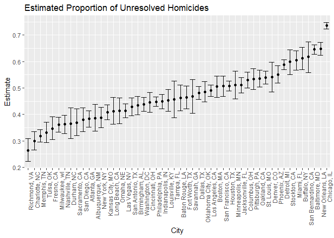

Homework 5 - Data Science I
================
Sunny Siddique
November 7, 2018

**Problem 1: Analysis of a longitudinal study data that contains a treatment arm and a placebo arm.**

``` r
#Setting global parameters and loading relevant packages
knitr::opts_chunk$set(echo = TRUE)
library(tidyverse)
library(purrr)
```

In attempting to import the dataset, I am first using the list.files function to view the files for the study participants. There are 20 different files (10 containing data for individuals in the treatment arm and 10 containing data for individuals in the control arm).

``` r
#Creating a new object "files" to which to store the datafiles.
files = list.files("./data")
files
```

    ##  [1] "con_01.csv" "con_02.csv" "con_03.csv" "con_04.csv" "con_05.csv"
    ##  [6] "con_06.csv" "con_07.csv" "con_08.csv" "con_09.csv" "con_10.csv"
    ## [11] "exp_01.csv" "exp_02.csv" "exp_03.csv" "exp_04.csv" "exp_05.csv"
    ## [16] "exp_06.csv" "exp_07.csv" "exp_08.csv" "exp_09.csv" "exp_10.csv"

``` r
#Saving the datafiles into raw list and then assigning it to "datasets".
raw = str_c("./data/", files)
datasets = tibble(subjects = files) %>% 
  mutate(data = map(raw, read_csv))
datasets
```

    ## # A tibble: 20 x 2
    ##    subjects   data            
    ##    <chr>      <list>          
    ##  1 con_01.csv <tibble [1 x 8]>
    ##  2 con_02.csv <tibble [1 x 8]>
    ##  3 con_03.csv <tibble [1 x 8]>
    ##  4 con_04.csv <tibble [1 x 8]>
    ##  5 con_05.csv <tibble [1 x 8]>
    ##  6 con_06.csv <tibble [1 x 8]>
    ##  7 con_07.csv <tibble [1 x 8]>
    ##  8 con_08.csv <tibble [1 x 8]>
    ##  9 con_09.csv <tibble [1 x 8]>
    ## 10 con_10.csv <tibble [1 x 8]>
    ## 11 exp_01.csv <tibble [1 x 8]>
    ## 12 exp_02.csv <tibble [1 x 8]>
    ## 13 exp_03.csv <tibble [1 x 8]>
    ## 14 exp_04.csv <tibble [1 x 8]>
    ## 15 exp_05.csv <tibble [1 x 8]>
    ## 16 exp_06.csv <tibble [1 x 8]>
    ## 17 exp_07.csv <tibble [1 x 8]>
    ## 18 exp_08.csv <tibble [1 x 8]>
    ## 19 exp_09.csv <tibble [1 x 8]>
    ## 20 exp_10.csv <tibble [1 x 8]>

In order to tidy up the dataset, I took the following steps:

``` r
#Assigning the tidy dataset into "participants" 
participants = unnest(datasets) %>% 

#Separating the subject variable into treatment "arm" and participant "id" variable.
  separate (subjects, into = c("arm", "id"), sep = "_") %>% 
  
#Separating the id varaible into "participant_id" and a variable called "remove" that will be dropped later. 
  separate (id, into = c("participant_id", "remove"), sep = 2) %>% 
  
#Dropping the "remove" variable
  select (-remove) %>% 
  
#Gathering the week variables under one column. 
  gather (key = week, value = observation, week_1:week_8) %>% 
  
#Tidying the week variable. 
  separate (week, into = c("remove", "week"), sep = "_") %>% 
  
#Removing the extra column
  select (-remove)

#Viewing the resulting dataset. 
head(participants)
```

    ## # A tibble: 6 x 4
    ##   arm   participant_id week  observation
    ##   <chr> <chr>          <chr>       <dbl>
    ## 1 con   01             1            0.2 
    ## 2 con   02             1            1.13
    ## 3 con   03             1            1.77
    ## 4 con   04             1            1.04
    ## 5 con   05             1            0.47
    ## 6 con   06             1            2.37

Making a spaghetti plot showing observations on each subject over time.

``` r
#Naming the spaghetti plot, "spaghetti"
spaghetti = participants %>% 
  
#Converting the participant_id into a character variable and the treatment arm varible into a factor variable to be able to piece together the spaghetti plot. 
  mutate(participant_id = as.character(participant_id),
         arm = as.factor(arm)) %>% 
  
#Generating spaghettiplot using ggplot. 
  ggplot(aes(x = week, y = observation, color = participant_id, group = participant_id)) +
  geom_point() + 
  geom_line() +
  facet_grid(~arm) +
  labs (
    title = "Time-trends of participants' condition",
        x = "Week",
        y = "Observation"
  )

#Viewing the spaghetti plot. 
spaghetti
```


In the spaghetti plot above, it appears that with time, the observation values for those in the experimental group appeared to increase whereas for those in the control group, the observation values remained approximately the same. Even though in the experimental group, there are small fluctuations each week, their overall trend seems to be increase with time.

------------------------------------------------------------------------

**Problem 2: Analysis of homicide data in 50 large US cities, by the Washington Post.**

``` r
#Reading in the dataset
homicide_data = read_csv("./homicide-data.csv") %>% 
  janitor::clean_names()
```

    ## Parsed with column specification:
    ## cols(
    ##   uid = col_character(),
    ##   reported_date = col_integer(),
    ##   victim_last = col_character(),
    ##   victim_first = col_character(),
    ##   victim_race = col_character(),
    ##   victim_age = col_character(),
    ##   victim_sex = col_character(),
    ##   city = col_character(),
    ##   state = col_character(),
    ##   lat = col_double(),
    ##   lon = col_double(),
    ##   disposition = col_character()
    ## )

This the dimension of this raw dataset is \[52,179 x 12\]. The rows of the dataset contain information regarding each individual convicted of homicide. There are a number of variables included regarding the convicted individual, including their name, race, age, sex, city, state and the decision of their case (disposition).

*Creating a city\_state variable and then summarizing within cities to obtain the total number of homicides and the number of unsolved homicides.*

``` r
#Creating a new dataset called homicide_totals
homicide_totals = homicide_data %>% 
  
#Creating the "city_state" variable by concatenating city and state variables.
  mutate(city_state = str_c(city, state, sep = ", ")) %>% 
  
#Filtering out Tulsa, AL because it appears that it's latitute and longitude does not exist (from discussion board question)
  filter(city_state != "Tulsa, AL") %>% 
  
#Making 50 groups by city_state variable. 
  group_by(city_state) %>% 
  
#Nesting within a larger list. 
  nest() %>% 
  
#Creating new variables that will map total_homicides and total_unresolved cases. 
  mutate (total_homicides = map(.x = data, ~.x %>% count()),
          total_unsolved = map(.x = data, ~.x %>% 
          filter(disposition %in% 
            c("Closed without arrest","Open/No arrest")) %>% 
                                 count())) %>% 

#Selecting relavant variables.
  select(city_state, total_homicides, total_unsolved) %>% 
  
#Unnesting to create individual dataframes.
  unnest() %>% 
  
#Changing the names from n to more descriptive column names.
  mutate(total_homicides = n, total_unsolved = n1)

#Creating a final tidy dataset by removing extra columns. 
homicide_total = homicide_totals %>% 
  select(-n, -n1)

#Viewing the final dataset.
homicide_total
```

    ## # A tibble: 50 x 3
    ##    city_state      total_homicides total_unsolved
    ##    <chr>                     <int>          <int>
    ##  1 Albuquerque, NM             378            146
    ##  2 Atlanta, GA                 973            373
    ##  3 Baltimore, MD              2827           1825
    ##  4 Baton Rouge, LA             424            196
    ##  5 Birmingham, AL              800            347
    ##  6 Boston, MA                  614            310
    ##  7 Buffalo, NY                 521            319
    ##  8 Charlotte, NC               687            206
    ##  9 Chicago, IL                5535           4073
    ## 10 Cincinnati, OH              694            309
    ## # ... with 40 more rows

*Proportion test for the city of Baltimore, MD.*

``` r
#Creating a new dataset for Baltimore
baltimore_data = homicide_total %>% 
  filter (city_state == "Baltimore, MD")

#Setting up proportion test for Baltimore.
balt_proptest = broom::tidy(prop.test(baltimore_data$total_unsolved, baltimore_data$total_homicides)) %>% 
  select(estimate, conf.low, conf.high)

#Viewing the results for the proportion test for Baltimore. 
balt_proptest
```

    ## # A tibble: 1 x 3
    ##   estimate conf.low conf.high
    ##      <dbl>    <dbl>     <dbl>
    ## 1    0.646    0.628     0.663

*Proportion test for each US city.*

``` r
#Defining a new function that will map the total number of unsolved cases / total number of cases for each city
homicide_function = 
  map2(.x = homicide_total$total_unsolved, 
       .y = homicide_total$total_homicides, 
       ~ prop.test(.x, .y))

#Iterating the homicide function for each US city
all_proptest = 
  map_df(.x = homicide_function, ~.x %>% 
                broom::tidy(.x) %>% 
                select(estimate, conf.low, conf.high)) %>% 
                mutate(city_state = homicide_total$city_state) %>% 
                select(city_state, everything())

#Viewing the resulting dataset
head(all_proptest)
```

    ## # A tibble: 6 x 4
    ##   city_state      estimate conf.low conf.high
    ##   <chr>              <dbl>    <dbl>     <dbl>
    ## 1 Albuquerque, NM    0.386    0.337     0.438
    ## 2 Atlanta, GA        0.383    0.353     0.415
    ## 3 Baltimore, MD      0.646    0.628     0.663
    ## 4 Baton Rouge, LA    0.462    0.414     0.511
    ## 5 Birmingham, AL     0.434    0.399     0.469
    ## 6 Boston, MA         0.505    0.465     0.545

*Plot showing the estimated proportion of unsolved cases to total cases by city (ordered by proportion).*

``` r
#Generation the plot
prop_plot = all_proptest %>% 
  
#Mutating to reorder the cities according to the proportion estimate.
  mutate(city_state = forcats::fct_reorder(city_state, estimate)) %>% 
  
#Generating the ggplot statement.
  ggplot(aes(x = city_state, y = estimate)) + geom_point() +
  geom_errorbar(mapping = aes(ymin = conf.low, ymax = conf.high)) +
  theme(axis.text.x = element_text(angle = 90, hjust = 1)) +
  labs (
    title = "Estimated Proportion of Unresolved Homicides",
        x = "City",
        y = "Estimate"
  )

#Viewing the plot
prop_plot
```


